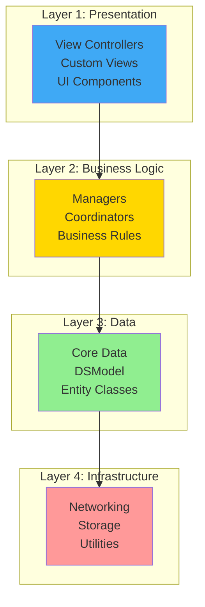
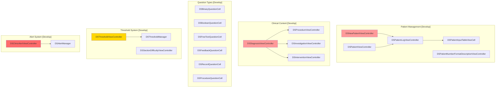
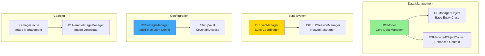

# System Component Architecture

## Table of Contents
1. [Overview](#overview)
2. [Component Layers](#component-layers)
3. [OSCE App Components](#osce-app-components)
4. [Develop App Components](#develop-app-components)
5. [Shared Components](#shared-components)
6. [Component Dependencies](#component-dependencies)
7. [Key Design Patterns](#key-design-patterns)

## Overview

Both LIFTUPP apps follow a **layered architecture** pattern with clear separation of concerns. This document maps all major components and their dependencies.

### Architecture Layers

Both apps use a 4-tier architecture:



## Component Layers

### Layer 1: Presentation (UIKit)
- View Controllers (58 in OSCE, 57 in Develop)
- Custom Views (DSView subclasses)
- Table View Cells
- UI Components (buttons, labels, navigation)

### Layer 2: Business Logic
- Settings Manager (multi-institution configuration)
- Sync Manager (server communication)
- Form Generator (assessment form creation)
- Timer Manager **[OSCE only]**
- Threshold Manager **[Develop only]**

### Layer 3: Data Layer
- DSModel (singleton Core Data manager)
- DSManagedObject (base entity class)
- Entity Classes (37 OSCE, 63 Develop)
- Core Data Stack (contexts, coordinator, model)

### Layer 4: Infrastructure
- DSHTTPSessionManager (networking)
- AFNetworking (HTTP client)
- KeychainStore (secure storage)
- DSImageCache (image management)
- CocoaLumberjack (logging)
- Firebase Crashlytics (crash reporting)

## OSCE App Components

### OSCE-Specific View Controllers (19 unique)

```mermaid
graph TD
    subgraph "Timer System [OSCE]"
        A[DSTimerViewController]
        B[DSTimerManager]
        C[DSCircuitTimerViewController]
    end

    subgraph "Comment System [OSCE]"
        D[DSCommentViewController]
        E[DSCommentMetaCircuitViewController]
        F[DSCommentMetaStationViewController]
        G[DSCommentMetaStationCandidateViewController]
    end

    subgraph "Marking System [OSCE]"
        H[DSMarkingMatrixViewController]
        I[DSMarkingDescriptorViewController]
    end

    subgraph "Assistance [OSCE]"
        J[DSAssistanceViewController]
        K[DSAssistanceRequestManager]
    end

    subgraph "Circuit Management [OSCE]"
        L[DSCircuitViewController]
        M[DSCircuitStationDurationViewController]
        N[DSStationRotationViewController]
    end

    A --> B
    C --> B
    D --> E
    D --> F
    D --> G
    H --> I
    J --> K
    L --> M
    L --> N

    style A fill:#3FA9F5
    style D fill:#3FA9F5
    style H fill:#3FA9F5
    style J fill:#FF6B6B
```



### OSCE Component Dependencies

**Timer System**:
- `DSTimerViewController` → `DSTimerManager` → `NSTimer`
- Countdown timers with amber/red alerts
- Synchronized across multiple iPads
- Audio/visual notifications

**Comment System**:
- Three-level hierarchy: Circuit → Station → Candidate
- Each level has dedicated view controller
- Comments stored in Core Data
- Synced UP to server

**Assistance Request System**:
- Real-time help requests
- Server-side aggregation
- Push notifications to teaching leads
- Status tracking (requested → responding → resolved)

**Marking Matrix**:
- Structured evaluation criteria
- Descriptor-based scoring
- Links to TypeForm definitions
- Consistent across assessors

## Develop App Components

### Develop-Specific View Controllers (20 unique)



### Develop Component Dependencies

**Patient Management**:
- `DSNewPatientViewController` creates `Patient` entities
- `DSPatientLogViewController` links patients to attendance logs
- Patient demographics (DOB, gender, ethnicity, pediatric flags)
- Patient numbering with institutional formats

**Clinical Content**:
- `DSDiagnosisViewController` → `Diagnosis` + `DiagnosisGroup` entities
- Procedure selection with difficulty levels
- Investigation ordering
- Intervention tracking

**Specialized Question Types**:
- 6 question cell types extending base `DSQuestionCell`
- Each handles specific data type (binary, boolean, free text, feedback, record, procedure)
- Auto-save to Core Data
- Validation and constraint checking

**Threshold System**:
- Adaptive difficulty-based thresholds
- Procedure-specific competency levels
- Student progression tracking
- Automatic competency alerts when thresholds met

**Clinical Alert System**:
- Alert type definitions (TypeClinicAlert)
- Alert instances (DataClinicAlert)
- Triggered by business rules (threshold met, procedure count, etc.)
- Synced to server for administrative action

## Shared Components

### Shared View Controllers (38 common)

```mermaid
graph TD
    subgraph "Core Assessment [Both]"
        A[DSFormViewController]
        B[DSFormSelectionViewController]
        C[DSFormListTableViewController]
        D[DSDataFormViewController]
    end

    subgraph "Student Management [Both]"
        E[DSStudentOverviewViewController]
        F[DSStudentDetailsViewController]
        G[DSAddStudentViewController]
        H[DSMasterViewController]
    end

    subgraph "Clinic Management [Both]"
        I[DSLiftuppClinicViewController]
        J[DSClinicInstancesViewController]
        K[DSClinicContainerViewController]
        L[DSDetailViewController]
    end

    subgraph "Sync & Settings [Both]"
        M[DSLiftuppSyncViewController]
        N[DSSyncPendingFormsTableViewController]
        O[DSSettingsViewController]
        P[DSAppSetupViewController]
    end

    subgraph "Staff Management [Both]"
        Q[DSStaffSelectionViewController]
        R[DSStaffSignInViewController]
    end

    A --> B
    B --> C
    E --> F
    E --> G
    I --> J
    I --> K
    K --> L
    M --> N

    style A fill:#90EE90
    style E fill:#90EE90
    style I fill:#90EE90
    style M fill:#90EE90
```



### Shared Business Logic Components



#### DSModel (Core Data Singleton)
**File**: `liftupp-app-library/Data Model/DSModel.m` (1,018 lines)

**Responsibilities**:
- Core Data stack initialization
- Managed object context management (3 contexts: main, sync, saving)
- Sync orchestration
- Date formatter caching
- State persistence

**Key Methods**:
```objc
+ (DSModel *)sharedModel
- (void)startSyncWithProgressChangeCallback:stageChangeCallback:completion:
- (void)prepareUploadDataWithCompletion:
- (void)processSyncData:uploadedObjects:callback:
```

**Dependencies**:
- `NSManagedObjectModel` (Core Data model)
- `NSPersistentStoreCoordinator` (SQLite coordinator)
- `DSSyncManager` (network sync)

---

#### DSSyncManager (Sync Coordinator)
**File**: `liftupp-app-library/Data Model/DSSyncManager.m`

**Responsibilities**:
- HTTP POST to sync endpoint
- Network reachability monitoring
- Sync request/response handling
- Error recovery

**Key Methods**:
```objc
+ (instancetype)manager
- (void)syncPostData:withCompletion:
- (NSString *)lastSyncTimeString
```

**Dependencies**:
- `DSHTTPSessionManager` (AFNetworking wrapper)
- `DSModel` (Core Data access)
- `Reachability` (network status)

---

#### DSSettingsManager (Configuration)
**File**: `liftupp-app-library/Data Model/DSSettingsManager.m` (1,023 lines)

**Responsibilities**:
- Multi-institution configuration
- Keychain-backed credential storage
- QR code provisioning
- Branding (colors, logos)
- API URL management

**Key Methods**:
```objc
+ (DSSettingsManager *)sharedSettingsManager
+ (void)configureAppWithJSON:configurationURL:completionBlock:
+ (BOOL)isLiverpool / isManchester / isQMUL / ...
- (void)setMainColorWithHexCode:
```

**Dependencies**:
- `StringVault` (Swift Keychain wrapper)
- `DSModel` (configuration storage)
- `DSHTTPSessionManager` (API setup calls)

---

#### DSHTTPSessionManager (Networking)
**File**: `liftupp-app-library/Data Model/DSBlockURLRequest/DSHTTPSessionManager.m`

**Responsibilities**:
- AFNetworking wrapper
- Basic authentication
- API endpoint management
- Reachability monitoring

**Key Methods**:
```objc
+ (instancetype)defaultSessionManager
+ (void)syncClient:success:failure:
+ (void)appSetup:success:failure:
+ (void)getStationAttendances:success:failure:
- (BOOL)isNetworkAvailable
```

**Dependencies**:
- `AFHTTPSessionManager` (AFNetworking)
- `AFNetworkReachabilityManager` (network status)

## Component Dependencies

### Overall Dependency Graph

```mermaid
graph TB
    subgraph "Presentation Layer"
        VC1[View Controllers<br/>OSCE: 58 / Develop: 57]
        UI1[Custom Views<br/>DSView subclasses]
    end

    subgraph "Business Logic Layer"
        SET[DSSettingsManager<br/>1023 lines]
        SYNC[DSSyncManager<br/>Sync Coordinator]
        TIMER[DSTimerManager<br/>[OSCE only]]
        THRESH[DSThresholdManager<br/>[Develop only]]
    end

    subgraph "Data Layer"
        MODEL[DSModel<br/>1018 lines]
        ENT[Entities<br/>OSCE: 37 / Develop: 63]
        CTX[DSManagedObjectContext<br/>Enhanced Context]
    end

    subgraph "Infrastructure Layer"
        HTTP[DSHTTPSessionManager]
        AF[AFNetworking 4.0]
        KEY[KeychainStore + StringVault]
        CACHE[DSImageCache]
        LOG[CocoaLumberjack<br/>[OSCE] / Native [Develop]]
        CRASH[Firebase Crashlytics]
    end

    VC1 --> SET
    VC1 --> SYNC
    VC1 --> MODEL
    VC1 --> TIMER
    VC1 --> THRESH
    UI1 --> SET

    SET --> KEY
    SET --> HTTP
    SYNC --> HTTP
    SYNC --> MODEL
    TIMER --> MODEL
    THRESH --> MODEL

    MODEL --> ENT
    MODEL --> CTX
    MODEL --> HTTP

    HTTP --> AF
    HTTP --> KEY
    CACHE --> AF

    style VC1 fill:#3FA9F5
    style MODEL fill:#90EE90
    style HTTP fill:#FFD700
    style AF fill:#FF9999
```

### Cross-Layer Dependencies

| Component | Layer | Depends On | Used By |
|-----------|-------|------------|---------|
| **DSModel** | Data | DSManagedObjectContext, DSSyncManager | All View Controllers, Business Logic |
| **DSSettingsManager** | Business | KeychainStore, DSHTTPSessionManager | All View Controllers, DSModel |
| **DSSyncManager** | Business | DSHTTPSessionManager, DSModel | DSModel, Sync View Controllers |
| **DSHTTPSessionManager** | Infrastructure | AFNetworking, Reachability | DSSyncManager, DSSettingsManager, Image Managers |
| **DSManagedObject** | Data | DSModel, NSManagedObject | All Entity Classes |
| **KeychainStore** | Infrastructure | iOS Keychain API | DSSettingsManager, StringVault |

### Circular Dependencies (Avoided)

The architecture carefully avoids circular dependencies:

✅ **Good**: View Controller → Model → Infrastructure
❌ **Avoided**: Infrastructure → Model (would create cycle)

**Example**:
- `DSHTTPSessionManager` does NOT depend on `DSModel`
- Instead, `DSSyncManager` mediates between them
- `DSModel` calls `DSSyncManager.syncPostData:`
- `DSSyncManager` calls `DSHTTPSessionManager.syncClient:`
- Response flows back through completion blocks

## Key Design Patterns

### 1. Singleton Pattern

**Usage**: Core managers accessed globally

**Implementations**:
```objc
// DSModel
+ (DSModel *)sharedModel {
    static DSModel *sharedInstance = nil;
    static dispatch_once_t onceToken;
    dispatch_once(&onceToken, ^{
        sharedInstance = [[DSModel alloc] init];
    });
    return sharedInstance;
}

// DSSettingsManager
+ (DSSettingsManager *)sharedSettingsManager {
    static DSSettingsManager *sharedInstance = nil;
    static dispatch_once_t onceToken;
    dispatch_once(&onceToken, ^{
        sharedInstance = [[DSSettingsManager alloc] init];
    });
    return sharedInstance;
}
```

**Singletons Used**:
- `DSModel.sharedModel`
- `DSSettingsManager.sharedSettingsManager`
- `DSSyncManager.manager`
- `DSHTTPSessionManager.defaultSessionManager`

**Rationale**: Ensures single source of truth for Core Data, settings, and network state.

### 2. Factory Pattern

**Usage**: Entity creation

**Implementation**:
```objc
@implementation DSManagedObject

+ (id)insert {
    NSManagedObjectContext *context = [DSModel sharedModel].managedObjectContext;
    return [NSEntityDescription insertNewObjectForEntityForName:[self entityName]
                                         inManagedObjectContext:context];
}

+ (id)managedObjectWithDictionary:(NSDictionary *)dictionary {
    // Create or fetch existing object
    // Populate from dictionary
    // Handle type conversions
    return object;
}

@end
```

**Usage**:
```objc
DSStudent *student = [DSStudent insert];
DSDataForm *form = [DSDataForm managedObjectWithDictionary:serverDict];
```

**Rationale**: Abstracts Core Data insertion complexity, ensures correct context usage.

### 3. Repository Pattern

**Usage**: Data access abstraction

**Implementation**:
```objc
@implementation DSManagedObject

+ (NSArray *)fetchAll {
    NSFetchRequest *request = [self fetchRequest];
    return [self.managedObjectContext executeFetchRequest:request error:nil];
}

+ (NSArray *)fetchAllWithPredicate:(NSPredicate *)predicate {
    NSFetchRequest *request = [self fetchRequest];
    request.predicate = predicate;
    return [self.managedObjectContext executeFetchRequest:request error:nil];
}

+ (id)managedObjectWithId:(NSString *)uniqueValue {
    NSPredicate *pred = [NSPredicate predicateWithFormat:@"%K == %@",
                        [self uniqueIdentifierPropertyName], uniqueValue];
    return [[self fetchAllWithPredicate:pred] firstObject];
}

@end
```

**Usage**:
```objc
NSArray *students = [DSStudent fetchAll];
NSArray *year3 = [DSStudent fetchAllWithPredicate:
    [NSPredicate predicateWithFormat:@"year == %@", @"Year 3"]];
DSStudent *john = [DSStudent managedObjectWithId:@"12345"];
```

**Rationale**: Encapsulates fetch logic, provides clean API for data access.

### 4. Observer Pattern

**Usage**: Core Data change notifications

**Implementation**:
```objc
// In View Controller
- (void)viewDidLoad {
    [super viewDidLoad];

    [[NSNotificationCenter defaultCenter] addObserver:self
                                            selector:@selector(contextDidSave:)
                                                name:NSManagedObjectContextDidSaveNotification
                                              object:nil];
}

- (void)contextDidSave:(NSNotification *)notification {
    [self.tableView reloadData];
}
```

**Notifications Used**:
- `NSManagedObjectContextDidSaveNotification` (Core Data saves)
- `UIApplicationDidEnterBackgroundNotification` (app lifecycle)
- `AFNetworkingReachabilityDidChangeNotification` (network status)

**Rationale**: Decouples UI updates from data changes, enables reactive updates.

### 5. Delegate Pattern

**Usage**: View controller communication

**Implementation**:
```objc
@protocol DSFormViewControllerDelegate <NSObject>
- (void)formViewController:(DSFormViewController *)controller
          didCompleteForm:(DSDataForm *)form;
@end

@interface DSFormViewController : UIViewController
@property (nonatomic, weak) id<DSFormViewControllerDelegate> delegate;
@end

// In implementation
- (void)saveForm {
    [self.delegate formViewController:self didCompleteForm:self.dataForm];
}
```

**Usage**:
```objc
@interface DSDetailViewController : UIViewController <DSFormViewControllerDelegate>
@end

@implementation DSDetailViewController
- (void)formViewController:(DSFormViewController *)controller
          didCompleteForm:(DSDataForm *)form {
    [self updateCompletionStatus];
    [self dismissViewControllerAnimated:YES completion:nil];
}
@end
```

**Rationale**: Loose coupling between view controllers, clear communication contracts.

### 6. Strategy Pattern

**Usage**: Sync direction strategies

**Implementation**:
```objc
// Entity metadata defines sync strategy
// userInfo dictionary in Core Data model:
// "uk.ac.liv.liftupp.coredata.sync.up" = YES → Upload strategy
// "uk.ac.liv.liftupp.coredata.sync.down" = YES → Download strategy

// DSModel reads strategy and applies appropriate logic
- (void)prepareUploadData {
    for (NSEntityDescription *entity in self.managedObjectModel.entities) {
        if ([entity shouldSyncUp]) {
            // Fetch changed objects
            // Build upload dictionary
        }
    }
}

- (void)processSyncData:(NSDictionary *)syncData {
    for (NSString *entityName in syncData) {
        NSEntityDescription *entity = [self entityNamed:entityName];
        if ([entity shouldSyncDown]) {
            // Process downloaded objects
            // Update Core Data
        }
    }
}
```

**Rationale**: Flexible sync configuration per entity without code changes.

### 7. Template Method Pattern

**Usage**: Base view controller setup

**Implementation**:
```objc
@implementation DSLiftuppSyncViewController

- (void)viewDidLoad {
    [super viewDidLoad];
    [self setupSyncCallbacks];
}

- (void)setupSyncCallbacks {
    // Template method - subclasses override blocks
    self.startSyncBlock = ^{
        // Default: show HUD
    };

    self.successfulEndSyncBlock = ^{
        // Default: hide HUD
    };
}

- (void)sync {
    if (self.startSyncBlock) self.startSyncBlock();

    [[DSModel sharedModel] startSyncWithProgressChangeCallback:^(float progress) {
        // Update progress
    } completion:^(DSSyncSuccessType success) {
        if (success == DSSyncSuccessTypeSuccess && self.successfulEndSyncBlock) {
            self.successfulEndSyncBlock();
        }
    }];
}

@end
```

**Usage**:
```objc
@implementation MyViewController  // Subclass of DSLiftuppSyncViewController

- (void)viewDidLoad {
    [super viewDidLoad];

    // Override template blocks
    self.successfulEndSyncBlock = ^{
        [self.tableView reloadData];
        [self showSuccessMessage];
    };
}

@end
```

**Rationale**: Provides common sync infrastructure while allowing customization.

### 8. MVC (Model-View-Controller)

**Architecture**: Strict MVC separation

**Implementation**:
- **Model**: Core Data entities (DSStudent, DSDataForm, etc.)
- **View**: UIKit views, custom DS views, XIB files
- **Controller**: View controllers mediate between model and view

**Example**:
```objc
@interface DSStudentViewController : UIViewController

// Model
@property (nonatomic, strong) DSStudent *student;

// View
@property (nonatomic, strong) IBOutlet UITableView *tableView;

@end

@implementation DSStudentViewController

// Controller mediates
- (void)viewDidLoad {
    [super viewDidLoad];
    [self updateViewFromModel];  // Model → View
}

- (void)saveButtonTapped {
    [self updateModelFromView];  // View → Model
    [[DSModel sharedModel].managedObjectContext save:nil];
}

@end
```

**Rationale**: Clear separation of concerns, testable components, iOS standard pattern.

---

## Summary

### Component Count Summary

| Category | OSCE | Develop | Shared |
|----------|------|---------|--------|
| **Total View Controllers** | 58 | 57 | 38 |
| **Unique View Controllers** | 19 | 20 | - |
| **Core Data Entities** | 37 | 63 | 27 |
| **Business Logic Managers** | 4 | 5 | 3 |
| **Infrastructure Components** | 6 | 6 | 6 |

### Shared Code Efficiency

- **80+ files** in `liftupp-app-library` shared between apps
- **~65% code reuse** (estimated based on shared components)
- **Common sync architecture** reduces duplication
- **Shared UI components** ensure consistent UX

### Design Pattern Usage

| Pattern | Usage Count | Purpose |
|---------|-------------|---------|
| **Singleton** | 4 managers | Global state management |
| **Factory** | All entities | Object creation |
| **Repository** | All entities | Data access |
| **Observer** | 10+ notifications | Event handling |
| **Delegate** | 30+ protocols | View controller communication |
| **Strategy** | Sync system | Flexible behavior selection |
| **Template Method** | Base VCs | Common workflow with customization |
| **MVC** | Everywhere | iOS standard architecture |

---

**For more information, see:**
- [Architecture Overview](architecture-overview.md) - High-level system design
- [Data Model Reference](data-model.md) - Entity details
- [Shared Library Documentation](shared-library.md) - liftupp-app-library API reference
- [Sync Architecture](sync-architecture.md) - Synchronization details
