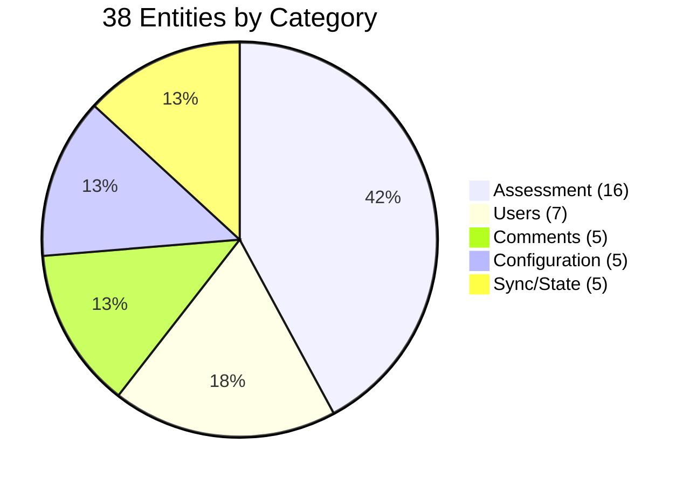
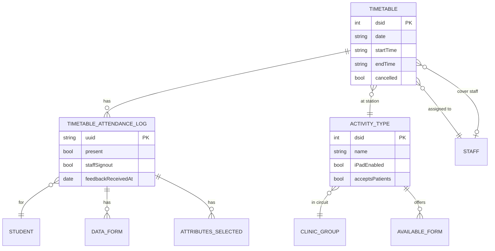
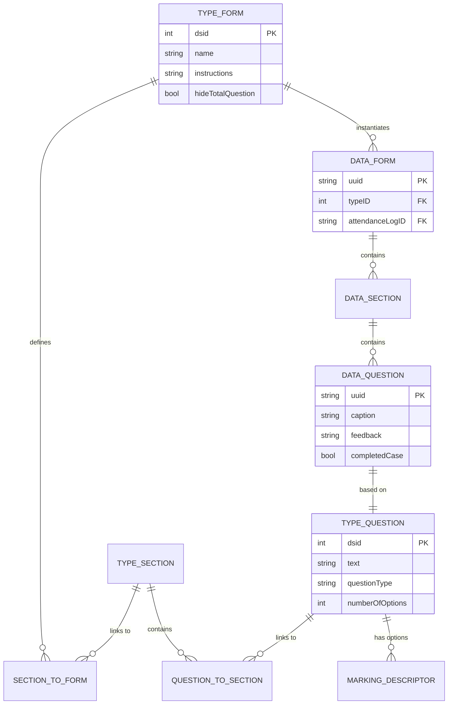
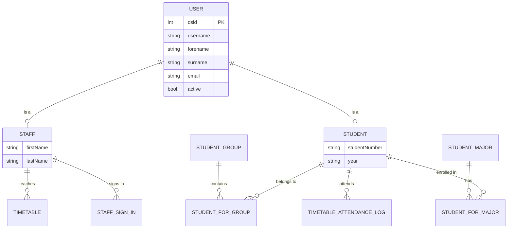

# Data Model Reference

## Table of Contents
1. [Overview](#overview)
2. [Entity Categories](#entity-categories)
3. [Entity Relationship Diagrams](#entity-relationship-diagrams)
4. [Core Entities](#core-entities)
5. [Assessment Entities](#assessment-entities)
6. [User Entities](#user-entities)
7. [Comment Entities](#comment-entities)
8. [Configuration Entities](#configuration-entities)
9. [Sync Metadata](#sync-metadata)
10. [Entity Reference](#entity-reference)

## Overview

The LIFTUPP data model consists of **38 Core Data entities** organized into a sophisticated schema supporting clinical assessments, student tracking, form management, and bidirectional synchronization.

### Key Characteristics
- **Object-relational model**: Core Data (SQLite-backed)
- **Model version**: V_1.0.5 (current)
- **Previous version**: V_1.0.4 (migration supported)
- **Primary keys**: `dsid` (Integer 32) or `uuid` (String UUID)
- **Soft deletes**: `dsDeleted` flag on most entities
- **Sync tracking**: Custom metadata in entity userInfo

### Model File Location
```
Model/
├── LIFTUPP.xcdatamodeld/
│   ├── V_1.0.4.xcdatamodel/
│   └── V_1.0.5.xcdatamodel/  ← Current
├── Entities/
│   ├── Generated/  ← Auto-generated base classes
│   └── Custom/     ← Hand-written extensions
└── KeychainStore.swift
```

## Entity Categories

### Category Distribution



| Category | Count | Purpose |
|----------|-------|---------|
| **Assessment** | 16 | Forms, sections, questions, timetables, attendance |
| **Users** | 7 | Staff, students, groups, majors |
| **Comments** | 5 | Feedback at circuit, station, and student levels |
| **Configuration** | 5 | App config, scenarios, disciplines, durations |
| **Sync/State** | 5 | Sync info, last updates, assistance, sign-ins |

## Entity Relationship Diagrams

### Core Assessment Flow



### Form Template-Instance Relationship



### User Hierarchy



## Core Entities

### Timetable

**Purpose**: Represents a scheduled teaching session at a specific station.

**File**: `Model/Entities/Custom/DSTimetable.h`

**Schema**:
```
Timetable {
    dsid: Integer 32 (PK)
    date: String                    "2023-10-15"
    startTime: String               "09:00"
    endTime: String                 "11:00"
    group: String                   "Year 3"
    order: Integer 16
    cancelled: Boolean
    dsDeleted: Boolean
    syncChangedKeys: Transformable (NSSet)
    syncNew: Boolean
    syncError: Boolean

    // Relationships
    activityType → ActivityType
    staff → Staff
    coverStaff → Staff              (syncs UP)
    scheduledCoverStaff → Staff     (syncs DOWN only)
    timetableAttendanceLogs → [TimetableAttendanceLog]
    staffSignIns → [StaffSignIn]
}
```

**Sync**: Bidirectional (DOWN + UP)
- DOWN: Base timetable schedule
- UP: Cover staff changes

**Computed Properties**:
```objc
- (DSStaff *)currentStaff;           // Returns active staff (cover or scheduled)
- (NSArray *)activeTimetableAttendanceLogs;
- (NSArray *)forms;
- (NSDate *)dateObject;              // Converts date string to NSDate
- (BOOL)hasTimetableAttendanceLogItems;
```

**Business Rules**:
- If `cancelled = YES`, session is not active
- `coverStaff` overrides `scheduledCoverStaff` when present
- `order` determines display sequence in UI

### TimetableAttendanceLog

**Purpose**: Records individual student attendance and assessment for a timetable session.

**File**: `Model/Entities/Custom/DSTimetableAttendanceLog.h`

**Schema**:
```
TimetableAttendanceLog {
    uuid: String (PK, UUID)
    present: Boolean
    order: Integer 32
    additional: Boolean             // Added after initial roster
    addedInApp: Boolean             // Created on iPad
    staffSignout: Boolean
    feedbackReceivedAt: Date
    feedbackAgreed: Boolean
    dsDeleted: Boolean
    syncChangedKeys: Transformable (NSSet)
    syncNew: Boolean
    syncError: Boolean

    // Relationships
    timetable → Timetable
    student → Student
    dataForms → [DataForm]          (cascade delete)
    currentForm → DataForm          (transient)
    candidateComment → [CommentMetaStationCandidate]
    attributes → [AttributesSelected]
}
```

**Sync**: Bidirectional (DOWN + UP)
- DOWN: Initial roster
- UP: Attendance updates, additional students, sign-outs

**Computed Methods**:
```objc
- (void)generateInitialForms;        // Creates form instances
- (BOOL)hasCommentOfType:(NSString *)type;
- (void)updateCircuitWithPresentValue;
```

**Lifecycle**:
1. Created on server (initial roster) OR created on iPad (`addedInApp = YES`)
2. Staff marks `present = YES/NO`
3. Forms generated via `generateInitialForms`
4. Assessment completed
5. `staffSignout = YES` when student signs out
6. Synced to server

### ActivityType (Station)

**Purpose**: Defines a type of clinical station or activity.

**File**: `Model/Entities/Custom/DSActivityType.h`

**Schema**:
```
ActivityType {
    dsid: Integer 32 (PK)
    name: String
    iPadEnabled: Boolean
    acceptsPatients: Boolean
    acceptsSimulatedPatient: Boolean
    requiresStudentSignout: Boolean
    dsDeleted: Boolean

    // Relationships
    clinicGroup → ClinicGroup
    teachingLead → Staff
    timetables → [Timetable]
    availableForms → [AvailableForm]
    stationComment → CommentMetaStation
    assistanceRequest → AssistanceRequested
}
```

**Sync**: DOWN only (server-defined)

**Computed Properties**:
```objc
- (NSArray *)activeTimetables;
- (NSArray *)activeAvailableForms;
```

**Types**:
- Clinical skills station (patient examination)
- Simulated patient station
- Skills lab station
- Break station (no assessment)

### ClinicGroup (Circuit)

**Purpose**: Groups multiple activity types into a circuit.

**File**: `Model/Entities/Custom/DSClinicGroup.h`

**Schema**:
```
ClinicGroup {
    dsid: Integer 32 (PK)
    name: String                    "Year 3 OSCE Circuit A"
    dsDeleted: Boolean

    // Relationships
    stations → [ActivityType]       (cascade delete)
    durations → [CircuitStationDuration]
    circuitComment → CommentMetaCircuit
    timetables → [Timetable]
    disciplines → [DisciplineForClinicGroup]
}
```

**Sync**: DOWN only

**Computed Properties**:
```objc
- (NSArray *)activeStations;
- (NSArray *)orderedDurations;       // Sorted by order
```

## Assessment Entities

### TypeForm (Template)

**Purpose**: Reusable assessment form template.

**File**: `Model/Entities/Custom/DSTypeForm.h`

**Schema**:
```
TypeForm {
    dsid: Integer 32 (PK)
    name: String                    "Clinical Skills Assessment"
    instructions: String            "Assess student's clinical competency"
    order: Integer 16
    hideTotalQuestion: Boolean
    props: String                   (JSON properties)
    dsDeleted: Boolean

    // Relationships
    clinicGroup → ClinicGroup
    sectionToForm → [SectionToForm]
    metadata → ScenarioMetadata
    availableForms → [AvailableForm]
}
```

**Sync**: DOWN only (created in web portal)

**Computed Methods**:
```objc
- (DSDataForm *)generateFormWithAttendanceLog:(DSTimetableAttendanceLog *)log;
```

**Usage Pattern**:
1. Created in web portal with sections and questions
2. Assigned to activity types via `AvailableForm`
3. Instantiated as `DataForm` when assessment begins

### TypeSection (Template)

**Schema**:
```
TypeSection {
    dsid: Integer 32 (PK)
    name: String                    "Clinical Skills"
    duplicable: Boolean             // Can create multiple instances
    foldable: Boolean               // Can collapse in UI
    quadAndTooth: Boolean           // Dental-specific: quadrant and tooth number
    information: String             // Help text
    matrixTitles: String            (JSON)
    maximumQuantity: Integer 16     // Max duplicates
    maximumDifficulty: Integer 16   // Difficulty scale
    dsDeleted: Boolean

    // Relationships
    sectionToForm → [SectionToForm]
    questionToSection → [QuestionToSection]
}
```

**Sync**: DOWN only

**Features**:
- **Duplicable sections**: For recording multiple cases (e.g., multiple patients)
- **Quad/Tooth**: Dental-specific fields for tooth notation
- **Matrix titles**: Custom column headers for marking matrices

### TypeQuestion (Template)

**Schema**:
```
TypeQuestion {
    dsid: Integer 32 (PK)
    text: String                    "Uses correct clinical technique"
    questionType: String            "binary", "rating", "text", "marking_matrix"
    information: String             // Help text
    mandatory: Boolean
    defaultState: Boolean

    // Binary question options
    binaryLow: Double               0.0
    binaryHigh: Double              1.0
    binaryLowText: String           "No"
    binaryHighText: String          "Yes"

    // Rating question options
    numberOfOptions: Integer 16     5
    includesUnknownRating: Boolean
    threshold: Double               3.0
    lowerThreshold: Double          2.0

    dsDeleted: Boolean

    // Relationships
    questionToSection → [QuestionToSection]
    options → [MarkingDescriptor]   (for marking matrix type)
}
```

**Sync**: DOWN only

**Question Types**:

| Type | Description | Data Captured |
|------|-------------|--------------|
| **binary** | Yes/No, Pass/Fail | Double (0.0 or 1.0) |
| **rating** | 1-5 scale, 1-10 scale | Double (1.0-5.0, etc.) |
| **text** | Free-text feedback | String |
| **marking_matrix** | Descriptive scale | Double + MarkingDescriptor |

### DataForm (Instance)

**Purpose**: Actual assessment form filled out by staff.

**Schema**:
```
DataForm {
    uuid: String (PK, UUID)
    dsDeleted: Boolean
    syncChangedKeys: Transformable (NSSet)
    syncNew: Boolean
    syncError: Boolean

    // Relationships
    type → TypeForm
    attendanceLog → TimetableAttendanceLog
    dataSections → [DataSection]    (cascade delete)
    activeForTimetable → Timetable  (transient)
}
```

**Sync**: UP only (user-generated)

**Computed Properties**:
```objc
- (NSArray *)orderedSections;        // Sorted by order
- (DSDataQuestion *)questionAtIndexPath:(NSIndexPath *)indexPath;
- (NSInteger)numberOfAnsweredQuestions;
- (BOOL)hasEnteredData;
```

**Lifecycle**:
1. Generated from TypeForm template
2. Staff enters assessment data
3. Form saved to Core Data
4. Marked for sync (`syncNew = YES`)
5. Uploaded to server on next sync

### DataSection (Instance)

**Schema**:
```
DataSection {
    uuid: String (PK, UUID)
    name: String
    order: Integer 32
    quantity: Integer 16            // For duplicable sections
    difficulty: Integer 16          // Difficulty rating
    quad: String                    // Dental quadrant
    tooth: String                   // Tooth number
    duplicable: Boolean
    expanded: Boolean               (transient, UI state)
    dsDeleted: Boolean
    syncChangedKeys: Transformable (NSSet)
    syncNew: Boolean
    syncError: Boolean

    // Relationships
    type → TypeSection
    dataForm → DataForm
    dataQuestions → [DataQuestion]  (cascade delete)
    sectionToFormLink → SectionToForm
}
```

**Sync**: UP only

**Computed Properties**:
```objc
- (NSArray *)orderedQuestions;
- (BOOL)hasEnteredData;
- (BOOL)hasCompletedSection;
- (NSInteger)maxNumberOfAnswerColumns;  // For layout
```

### DataQuestion (Instance, Abstract)

**Purpose**: Base class for question instances. Subclassed by RatingQuestion.

**Schema**:
```
DataQuestion {
    uuid: String (PK, UUID)
    caption: String                 // Question text
    feedback: String                // Staff feedback
    order: Integer 32
    completedCase: Boolean
    recommended: Boolean
    dsDeleted: Boolean
    syncChangedKeys: Transformable (NSSet)
    syncNew: Boolean
    syncError: Boolean

    // Relationships
    type → TypeQuestion
    dataSection → DataSection
    attributes → [AttributesSelected]
}
```

**Sync**: UP only

**Subclass: RatingQuestion**:
```
RatingQuestion extends DataQuestion {
    rating: Double                  // The actual rating value
}
```

### MarkingDescriptor

**Purpose**: Defines a marking matrix option with descriptive text.

**Schema**:
```
MarkingDescriptor {
    dsid: Integer 32 (PK)
    descriptor: String              "Excellent - Consistently demonstrates..."
    value: Double                   5.0
    order: Integer 16
    dsDeleted: Boolean

    // Relationships
    question → TypeQuestion
}
```

**Sync**: DOWN only

**Example Marking Matrix**:
```
Question: "Clinical Technique"
Descriptors:
  5.0 → "Excellent - Demonstrates advanced competency"
  4.0 → "Good - Competent with minor areas for improvement"
  3.0 → "Satisfactory - Meets minimum standard"
  2.0 → "Needs Improvement - Requires supervision"
  1.0 → "Unsatisfactory - Unsafe practice"
  ?   → "Unable to assess"
```

### Link Entities

**SectionToForm**: Many-to-many link between TypeForm and TypeSection
```
SectionToForm {
    dsid: Integer 32 (PK)
    order: Integer 16
    section → TypeSection
    form → TypeForm
}
```

**QuestionToSection**: Many-to-many link between TypeSection and TypeQuestion
```
QuestionToSection {
    dsid: Integer 32 (PK)
    order: Integer 16
    question → TypeQuestion
    section → TypeSection
}
```

**AvailableForm**: Links TypeForm to ActivityType
```
AvailableForm {
    dsid: Integer 32 (PK)
    order: Integer 16
    typeForm → TypeForm
    activityType → ActivityType
}
```

## User Entities

### User (Abstract Base Class)

**Purpose**: Base entity for all users (staff and students).

**Schema**:
```
User {
    dsid: Integer 32 (PK)
    username: String
    forename: String
    surname: String
    title: String                   "Dr.", "Prof.", etc.
    email: String
    passcode: String                (stored in Keychain)
    active: Boolean
    dsAdviserId: Integer 32         (FK to staff adviser)
    dsDeleted: Boolean

    // Relationships
    commentsWritten → [Comment]
    commentsReceived → [Comment]
}
```

**Sync**: DOWN only

**Subclasses**: Staff, Student

### Staff

**File**: `Model/Entities/Generated/_DSStaff.h`

**Schema**:
```
Staff extends User {
    firstName: String               (duplicate of forename)
    lastName: String                (duplicate of surname)

    // Relationships
    assignedTimetables → [Timetable]
    coverTimetables → [Timetable]
    scheduledCoverTimetables → [Timetable]
    teachingActivities → [ActivityType]
    staffSignIns → [StaffSignIn]
}
```

**Sync**: DOWN only

### Student

**File**: `Model/Entities/Generated/_DSStudent.h`

**Schema**:
```
Student extends User {
    studentNumber: String
    year: String                    "Year 3", "Year 4", etc.

    // Relationships
    attendanceLogs → [TimetableAttendanceLog]
    studentGroups → [StudentForGroup]
    studentMajors → [StudentForMajor]
}
```

**Sync**: DOWN only

**Computed Properties**:
```objc
- (DSStudentMajor *)major;           // Primary major
```

### StudentGroup

**Purpose**: Grouping of students (e.g., tutorial groups, cohorts).

**Schema**:
```
StudentGroup {
    dsid: Integer 32 (PK)
    name: String                    "Group A", "Morning Group"
    dsDeleted: Boolean

    // Relationships
    students → [StudentForGroup]
}
```

**Sync**: DOWN only

### StudentMajor

**Purpose**: Academic program or major (e.g., Dentistry, Medicine).

**Schema**:
```
StudentMajor {
    dsid: Integer 32 (PK)
    name: String                    "BDS Dentistry", "MBBS Medicine"
    dsDeleted: Boolean

    // Relationships
    students → [StudentForMajor]
}
```

**Sync**: DOWN only

### Join Tables

**StudentForGroup**: Many-to-many
```
StudentForGroup {
    dsid: Integer 32 (PK)
    student → Student
    group → StudentGroup
}
```

**StudentForMajor**: Many-to-many
```
StudentForMajor {
    dsid: Integer 32 (PK)
    student → Student
    major → StudentMajor
}
```

## Comment Entities

### Comment

**Purpose**: General comment or feedback.

**Schema**:
```
Comment {
    uuid: String (PK, UUID)
    text: String
    date: String
    dsDeleted: Boolean
    syncChangedKeys: Transformable (NSSet)
    syncNew: Boolean
    syncError: Boolean

    // Relationships
    writer → User
    recipient → User
    group → CommentGroup
}
```

**Sync**: UP only

### CommentGroup

**Purpose**: Categorizes comments.

**Schema**:
```
CommentGroup {
    dsid: Integer 32 (PK)
    name: String                    "Positive Feedback", "Areas for Improvement"
    dsDeleted: Boolean

    // Relationships
    comments → [Comment]
}
```

**Sync**: DOWN only

### CommentMetaCircuit

**Purpose**: Comments about entire circuit/clinic session.

**Schema**:
```
CommentMetaCircuit {
    uuid: String (PK, UUID)
    text: String
    dsDeleted: Boolean
    syncChangedKeys: Transformable (NSSet)
    syncNew: Boolean
    syncError: Boolean

    // Relationships
    circuit → ClinicGroup
}
```

**Sync**: UP only

### CommentMetaStation

**Purpose**: Comments about specific station.

**Schema**:
```
CommentMetaStation {
    uuid: String (PK, UUID)
    text: String
    dsDeleted: Boolean
    syncChangedKeys: Transformable (NSSet)
    syncNew: Boolean
    syncError: Boolean

    // Relationships
    station → ActivityType
}
```

**Sync**: UP only

### CommentMetaStationCandidate

**Purpose**: Comments about student performance at specific station.

**Schema**:
```
CommentMetaStationCandidate {
    uuid: String (PK, UUID)
    text: String
    dsDeleted: Boolean
    syncChangedKeys: Transformable (NSSet)
    syncNew: Boolean
    syncError: Boolean

    // Relationships
    attendanceLog → TimetableAttendanceLog
}
```

**Sync**: UP only

## Configuration Entities

### Config

**Purpose**: Application configuration from server.

**File**: `Model/Entities/Custom/DSConfig.h`

**Schema**:
```
Config {
    dsid: Integer 32 (PK)
    universityCode: String          "liverpool", "manchester", etc.
    configURL: String               URL for QR code configuration
    dsDeleted: Boolean
}
```

**Sync**: DOWN only

**Behavior**:
- When synced, if `universityCode` matches, automatically reconfigures app
- Enables remote configuration updates

### ScenarioMetadata

**Purpose**: Instructions and metadata for OSCE scenarios.

**Schema**:
```
ScenarioMetadata {
    dsid: Integer 32 (PK)
    assessorInstructions: String
    candidateInstructions: String
    dsDeleted: Boolean

    // Relationships
    typeForm → TypeForm
}
```

**Sync**: DOWN only

### Discipline

**Purpose**: Academic discipline (e.g., Dentistry, Physio).

**Schema**:
```
Discipline {
    dsid: Integer 32 (PK)
    name: String
    dsDeleted: Boolean

    // Relationships
    clinicGroups → [DisciplineForClinicGroup]
}
```

**Sync**: DOWN only

### DisciplineForClinicGroup

**Purpose**: Links disciplines to clinic groups.

**File**: `Model/Entities/Custom/DSDisciplineForClinicGroup.h`

**Schema**:
```
DisciplineForClinicGroup {
    dsid: Integer 32 (PK)
    clinic_group_id: Integer 32     (FK)
    discipline_id: Integer 32       (FK)
    dsDeleted: Boolean

    // Relationships
    clinicGroup → ClinicGroup
    discipline → Discipline
}
```

**Sync**: DOWN only

### CircuitStationDuration

**Purpose**: Timing configuration for station rotations.

**Schema**:
```
CircuitStationDuration {
    dsid: Integer 32 (PK)
    duration: Integer 16            Minutes
    durationType: String            "rotation", "break", etc.
    manualStart: Integer 16         Boolean-like flag
    order: Integer 16
    dsDeleted: Boolean

    // Relationships
    clinicGroup → ClinicGroup
}
```

**Sync**: DOWN only

**Example**:
```
Circuit durations (ordered):
1. duration=15, durationType="rotation" → 15 min station
2. duration=15, durationType="rotation" → 15 min station
3. duration=10, durationType="break"    → 10 min break
4. duration=15, durationType="rotation" → 15 min station
```

## Sync Metadata

### SyncInformation

**Purpose**: Records device sync history.

**Schema**:
```
SyncInformation {
    uuid: String (PK, UUID)
    lastSync: Date
    deviceUUID: String
    deviceName: String              "iPad Pro - Clinic 1"
    appUUID: String
    appVersion: String              "1.0.24"
    iOSVersion: String              "15.0"
    dsDeleted: Boolean
    syncChangedKeys: Transformable (NSSet)
    syncNew: Boolean
    syncError: Boolean

    // Relationships
    staff → Staff
}
```

**Sync**: UP only

**Purpose**:
- Audit trail of which devices synced when
- Troubleshooting sync issues
- Device management

### StaffSignIn

**Purpose**: Records staff sign-in to timetable.

**Schema**:
```
StaffSignIn {
    uuid: String (PK, UUID)
    time: Date
    appUUID: String
    dsDeleted: Boolean
    syncChangedKeys: Transformable (NSSet)
    syncNew: Boolean
    syncError: Boolean

    // Relationships
    staff → Staff
    timetable → Timetable
}
```

**Sync**: UP only

**Purpose**:
- Track which staff members signed into which sessions
- Compliance and accountability
- Resolve disputes about coverage

### AssistanceRequested

**Purpose**: Tracks assistance requests during sessions.

**Schema**:
```
AssistanceRequested {
    dsid: Integer 32 (PK)
    assistanceRequired: Boolean
    timeRequested: String
    dsDeleted: Boolean

    // Relationships
    station → ActivityType
    circuit → ClinicGroup
}
```

**Sync**: DOWN only (server aggregates from multiple devices)

### LastUpdate

**Purpose**: Tracks last sync timestamp per entity type.

**Schema**:
```
LastUpdate {
    lastUpdateType: String (PK)     Entity name (e.g., "student")
    last_update: String             ISO timestamp "2023-10-15 14:30:00"
}
```

**Sync**: Local only (not synced)

**Usage**:
- Sent to server as `lastUpdate` to get incremental updates
- Server returns only records modified since last sync
- Improves sync performance

### AttributesSelected

**Purpose**: Tracks selected attributes for questions (unclear exact usage).

**Schema**:
```
AttributesSelected {
    // No explicit PK (Core Data assigns)
    dsDeleted: Boolean

    // Relationships
    question → DataQuestion
    attendanceLog → TimetableAttendanceLog
}
```

**Sync**: Not synced (local only)

## Entity Reference

### Complete Entity List

| # | Entity | Primary Key | Sync Direction | Purpose |
|---|--------|-------------|----------------|---------|
| 1 | ActivityType | dsid | DOWN | Station types |
| 2 | AssistanceRequested | dsid | DOWN | Help requests |
| 3 | AttributesSelected | auto | Local | Question attributes |
| 4 | AvailableForm | dsid | DOWN | Form-to-station mapping |
| 5 | CircuitStationDuration | dsid | DOWN | Rotation timing |
| 6 | ClinicGroup | dsid | DOWN | Circuits |
| 7 | Comment | uuid | UP | General comments |
| 8 | CommentGroup | dsid | DOWN | Comment categories |
| 9 | CommentMetaCircuit | uuid | UP | Circuit comments |
| 10 | CommentMetaStation | uuid | UP | Station comments |
| 11 | CommentMetaStationCandidate | uuid | UP | Student comments |
| 12 | Config | dsid | DOWN | App configuration |
| 13 | DataForm | uuid | UP | Assessment instances |
| 14 | DataQuestion | uuid | UP | Question instances (abstract) |
| 15 | DataSection | uuid | UP | Section instances |
| 16 | Discipline | dsid | DOWN | Academic disciplines |
| 17 | DisciplineForClinicGroup | dsid | DOWN | Discipline-circuit link |
| 18 | LastUpdate | lastUpdateType | Local | Sync timestamps |
| 19 | MarkingDescriptor | dsid | DOWN | Marking options |
| 20 | QuestionToSection | dsid | DOWN | Question-section link |
| 21 | RatingQuestion | uuid | UP | Rating question instance |
| 22 | ScenarioMetadata | dsid | DOWN | OSCE instructions |
| 23 | SectionToForm | dsid | DOWN | Section-form link |
| 24 | Staff | dsid | DOWN | Staff users |
| 25 | StaffSignIn | uuid | UP | Staff sign-in records |
| 26 | Student | dsid | DOWN | Student users |
| 27 | StudentForGroup | dsid | DOWN | Student-group link |
| 28 | StudentForMajor | dsid | DOWN | Student-major link |
| 29 | StudentGroup | dsid | DOWN | Student groupings |
| 30 | StudentMajor | dsid | DOWN | Academic programs |
| 31 | SyncInformation | uuid | UP | Sync audit trail |
| 32 | Timetable | dsid | BOTH | Scheduled sessions |
| 33 | TimetableAttendanceLog | uuid | BOTH | Student attendance |
| 34 | TypeForm | dsid | DOWN | Form templates |
| 35 | TypeQuestion | dsid | DOWN | Question templates |
| 36 | TypeSection | dsid | DOWN | Section templates |
| 37 | User | dsid | DOWN | Base user (abstract) |
| 38 | — | — | — | (Total: 38 entities) |

### Sync Direction Summary

- **DOWN only (23)**: Reference data from server
- **UP only (9)**: User-generated data to server
- **Bidirectional (2)**: Timetable, TimetableAttendanceLog
- **Local only (2)**: LastUpdate, AttributesSelected

### Common Attributes

**All syncable entities include**:
- `dsDeleted` (Boolean) - Soft delete flag
- `syncNew` (Boolean) - Newly created, needs upload
- `syncError` (Boolean) - Sync error occurred
- `syncChangedKeys` (Transformable NSSet) - Tracks changed attributes

**Primary key patterns**:
- `dsid` (Integer 32): Server-assigned IDs for reference data
- `uuid` (String): Client-generated UUIDs for user data

---

**For implementation details, see:**
- [Architecture Overview](architecture-overview.md) - Overall system design
- [Sync Architecture](sync-architecture.md) - Synchronization mechanisms
- [Shared Library Documentation](shared-library.md) - Base classes (DSManagedObject, etc.)
