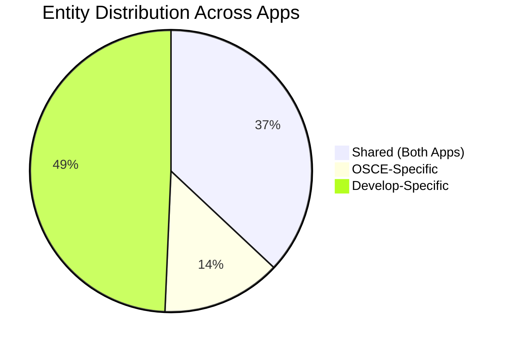

# Data Model Reference - OSCE & Develop Apps

## Table of Contents
1. [Overview](#overview)
2. [Model Comparison](#model-comparison)
3. [Shared Entities (27)](#shared-entities-27)
4. [OSCE-Specific Entities (10)](#osce-specific-entities-10)
5. [Develop-Specific Entities (36)](#develop-specific-entities-36)
6. [Key Entity Details](#key-entity-details)
7. [Sync Metadata](#sync-metadata)

## Overview

The LIFTUPP platform consists of two iPad applications with different Core Data models optimized for their specific purposes:

### Model Summary

| App | Entities | Model Version | Focus |
|-----|----------|---------------|-------|
| **OSCE** | 37 | V_1.0.5 | Examination circuits and station-based assessment |
| **Develop** | 63 | LIFTUPP 2.1.3 | Clinical teaching with patient management |
| **Shared** | 27 | Common | Core assessment framework |

### Key Characteristics

**Common to Both:**
- Object-relational model using Core Data (SQLite-backed)
- Primary keys: `dsid` (Integer 32) or `uuid` (String UUID)
- Soft deletes: `dsDeleted` flag on most entities
- Sync tracking: Custom metadata in entity userInfo

**OSCE-Specific:**
- Focus on exam circuits with timed rotations
- Comment system for feedback at multiple levels
- Assistance request tracking

**Develop-Specific:**
- Patient records with full demographics
- Clinical content (diagnoses, procedures, investigations, interventions)
- 6 specialized question types
- Adaptive threshold system
- Clinical alert management

## Model Comparison

### Entity Distribution



### Functional Comparison

| Category | OSCE | Develop | Shared |
|----------|------|---------|--------|
| **Assessment Framework** | TypeForm, DataForm, Marking | TypeForm, DataForm, Thresholds | Forms, Sections, Questions |
| **User Management** | Staff, Student | Staff, Student | User, Groups, Majors |
| **Clinical Content** | - | Patient, Diagnosis, Procedure, Investigation, Intervention | - |
| **Feedback System** | Comments (Circuit, Station, Candidate) | Thresholds, Alerts | - |
| **Question Types** | Standard questions | 6 specialized subtypes | TypeQuestion, DataQuestion |
| **Station Management** | CircuitStationDuration, AssistanceRequested | - | ActivityType, ClinicGroup |
| **Sync** | SyncInformation | SyncInformation | LastUpdate |

## Shared Entities (27)

These entities form the common assessment framework used by both apps:

### Assessment Form Framework (9 entities)
**[Both]**
- **TypeForm** - Reusable form templates
- **DataForm** - Completed form instances
- **TypeSection** - Form section templates
- **DataSection** - Section instances
- **TypeQuestion** - Question templates
- **DataQuestion** - Question instances (abstract base class)
- **RatingQuestion** - Rating-type questions (extends DataQuestion)
- **MarkingDescriptor** - Marking matrix options
- **AvailableForm** - Form-to-station mapping

### Linking Entities (2 entities)
**[Both]**
- **SectionToForm** - Many-to-many: TypeSection ↔ TypeForm
- **QuestionToSection** - Many-to-many: TypeQuestion ↔ TypeSection

### User Management (7 entities)
**[Both]**
- **User** - Base class for all users (abstract)
- **Staff** - Teaching staff and assessors
- **Student** - Students/candidates
- **StudentGroup** - Student groupings (tutorial groups, cohorts)
- **StudentMajor** - Academic programs (BDS, MBBS, etc.)
- **StudentForGroup** - Many-to-many: Student ↔ StudentGroup
- **StudentForMajor** - Many-to-many: Student ↔ StudentMajor

### Clinical Session Management (3 entities)
**[Both]**
- **Timetable** - Scheduled teaching sessions at stations
- **TimetableAttendanceLog** - Student attendance records
- **ActivityType** - Station/activity types

### Clinic Organization (3 entities)
**[Both]**
- **ClinicGroup** - Circuits/clinic groupings
- **Discipline** - Academic disciplines (Dentistry, Medicine)
- **DisciplineForClinicGroup** - Many-to-many: Discipline ↔ ClinicGroup

### System Management (3 entities)
**[Both]**
- **Config** - Application configuration
- **StaffSignIn** - Staff sign-in audit trail
- **SyncInformation** - Sync audit records
- **LastUpdate** - Per-entity sync timestamps

## OSCE-Specific Entities (10)

These entities support OSCE examination delivery with structured circuits:

### Comment System (5 entities)
**[OSCE]**

#### CommentMetaCircuit
- **Purpose**: Comments about entire clinic session/circuit
- **Sync**: UP only (user-generated)
```
CommentMetaCircuit {
    uuid: String (PK)
    text: String
    dsDeleted: Boolean
    syncChangedKeys, syncNew, syncError
    circuit → ClinicGroup
}
```

#### CommentMetaStation
- **Purpose**: Comments about specific station
- **Sync**: UP only
```
CommentMetaStation {
    uuid: String (PK)
    text: String
    dsDeleted: Boolean
    syncChangedKeys, syncNew, syncError
    station → ActivityType
}
```

#### CommentMetaStationCandidate
- **Purpose**: Comments about student performance at station
- **Sync**: UP only
```
CommentMetaStationCandidate {
    uuid: String (PK)
    text: String
    dsDeleted: Boolean
    syncChangedKeys, syncNew, syncError
    attendanceLog → TimetableAttendanceLog
}
```

#### Comment
- **Purpose**: General comments with writer/recipient
- **Sync**: UP only
```
Comment {
    uuid: String (PK)
    text: String
    date: String
    dsDeleted: Boolean
    writer → User
    recipient → User
    group → CommentGroup
}
```

#### CommentGroup
- **Purpose**: Comment categorization (e.g., "Positive Feedback", "Areas for Improvement")
- **Sync**: DOWN only
```
CommentGroup {
    dsid: Integer 32 (PK)
    name: String
    dsDeleted: Boolean
    comments → [Comment]
}
```

### Circuit Management (2 entities)
**[OSCE]**

#### CircuitStationDuration
- **Purpose**: Timing configuration for station rotations
- **Sync**: DOWN only
```
CircuitStationDuration {
    dsid: Integer 32 (PK)
    duration: Integer 16              // Minutes
    durationType: String              // "rotation", "break"
    manualStart: Integer 16
    order: Integer 16
    dsDeleted: Boolean
    clinicGroup → ClinicGroup
}
```

**Usage Example**:
```
1. duration=15, durationType="rotation" → 15 min station
2. duration=15, durationType="rotation" → 15 min station
3. duration=10, durationType="break"    → 10 min break
4. duration=15, durationType="rotation" → 15 min station
```

#### AssistanceRequested
- **Purpose**: Real-time assistance request tracking
- **Sync**: DOWN only (server aggregates from multiple devices)
```
AssistanceRequested {
    dsid: Integer 32 (PK)
    assistanceRequired: Boolean
    timeRequested: String
    dsDeleted: Boolean
    station → ActivityType
    circuit → ClinicGroup
}
```

### Other OSCE Entities (3 entities)
**[OSCE]**

#### ScenarioMetadata
- **Purpose**: OSCE scenario instructions
- **Sync**: DOWN only
```
ScenarioMetadata {
    dsid: Integer 32 (PK)
    assessorInstructions: String
    candidateInstructions: String
    dsDeleted: Boolean
    typeForm → TypeForm
}
```

#### AttributesSelected
- **Purpose**: Tracks selected attributes for questions
- **Sync**: Local only (not synced)
```
AttributesSelected {
    dsDeleted: Boolean
    question → DataQuestion
    attendanceLog → TimetableAttendanceLog
}
```

## Develop-Specific Entities (36)

These entities support clinical teaching with patient case management:

### Patient Management (10 entities)
**[Develop]**

#### Patient
- **Purpose**: Core patient record
- **File**: `Model/Entities/Custom/DSPatient.h`
- **Sync**: Likely DOWN only
```
Patient {
    dsid: Integer 32 (PK)
    patientID: String                  // Hospital patient number
    dateOfBirth: Date
    gender: String                     // "Male", "Female", etc.
    isPediatric: Boolean
    isSimulated: Boolean               // Simulated patient flag
    ethnicity → Ethnicity
    patientLogs → [PatientLog]
    dsDeleted: Boolean
}
```

#### PatientLog
- **Purpose**: Patient encounter/interaction tracking
- **Sync**: UP only (user-generated)
```
PatientLog {
    uuid: String (PK)
    encounterDate: Date
    notes: String
    patient → Patient
    student → Student
    attendanceLog → TimetableAttendanceLog
    dsDeleted: Boolean
    syncChangedKeys, syncNew, syncError
}
```

#### PatientNumberFormat
- **Purpose**: Institution-specific patient numbering schemes
- **Sync**: DOWN only
```
PatientNumberFormat {
    dsid: Integer 32 (PK)
    formatString: String               // e.g., "P-NNNN-YY"
    description: String
    dsDeleted: Boolean
}
```

#### Diagnosis
- **Purpose**: Medical diagnoses
- **Sync**: DOWN only (reference data)
```
Diagnosis {
    dsid: Integer 32 (PK)
    name: String                       // e.g., "Dental Caries"
    code: String                       // ICD-10 or similar
    description: String
    diagnosisGroup → DiagnosisGroup
    dsDeleted: Boolean
}
```

#### DiagnosisGroup
- **Purpose**: Diagnosis categorization
- **Sync**: DOWN only
```
DiagnosisGroup {
    dsid: Integer 32 (PK)
    name: String                       // e.g., "Periodontal Diseases"
    diagnoses → [Diagnosis]
    dsDeleted: Boolean
}
```

#### Procedure
- **Purpose**: Clinical procedures (e.g., "Tooth Extraction", "Filling")
- **Sync**: DOWN only
```
Procedure {
    dsid: Integer 32 (PK)
    name: String
    code: String
    description: String
    difficulty: Integer 16
    dsDeleted: Boolean
}
```

#### Intervention
- **Purpose**: Therapeutic interventions
- **Sync**: DOWN only
```
Intervention {
    dsid: Integer 32 (PK)
    name: String
    description: String
    dsDeleted: Boolean
}
```

#### Investigation
- **Purpose**: Diagnostic tests (e.g., "X-ray", "Blood Test")
- **Sync**: DOWN only
```
Investigation {
    dsid: Integer 32 (PK)
    name: String
    description: String
    dsDeleted: Boolean
}
```

#### Ethnicity
- **Purpose**: Patient ethnicity tracking
- **Sync**: DOWN only
```
Ethnicity {
    dsid: Integer 32 (PK)
    name: String
    ethnicityGroup → EthnicityGroup
    dsDeleted: Boolean
}
```

#### EthnicityGroup
- **Purpose**: Ethnicity categorization
- **Sync**: DOWN only
```
EthnicityGroup {
    dsid: Integer 32 (PK)
    name: String
    ethnicities → [Ethnicity]
    dsDeleted: Boolean
}
```

### Clinical Assessment Components (4 entities)
**[Develop]**

#### Area
- **Purpose**: Assessment/clinical areas (anatomical or functional)
- **Sync**: DOWN only
```
Area {
    dsid: Integer 32 (PK)
    name: String                       // e.g., "Oral Cavity", "Maxillofacial"
    dsDeleted: Boolean
}
```

#### Stage
- **Purpose**: Disease progression stages
- **Sync**: DOWN only
```
Stage {
    dsid: Integer 32 (PK)
    name: String                       // e.g., "Early", "Advanced"
    order: Integer 16
    dsDeleted: Boolean
}
```

#### Material
- **Purpose**: Clinical materials/resources
- **Sync**: DOWN only
```
Material {
    dsid: Integer 32 (PK)
    name: String
    description: String
    dsDeleted: Boolean
}
```

#### Individual
- **Purpose**: Individual assessment components
- **Sync**: DOWN only
```
Individual {
    dsid: Integer 32 (PK)
    name: String
    description: String
    dsDeleted: Boolean
}
```

### Enhanced Question Types (6 entities)
**[Develop]**

Develop extends the base DataQuestion with specialized subtypes:

#### BinaryQuestion
- **Purpose**: True/False, Yes/No questions with specialized feedback
- **Extends**: DataQuestion
```
BinaryQuestion extends DataQuestion {
    binaryValue: Boolean
    // Inherits: uuid, caption, feedback, order, completedCase
}
```

#### BooleanQuestion
- **Purpose**: Boolean data questions
- **Extends**: DataQuestion
```
BooleanQuestion extends DataQuestion {
    booleanValue: Boolean
}
```

#### FreeTextQuestion
- **Purpose**: Open-ended text responses
- **Extends**: DataQuestion
```
FreeTextQuestion extends DataQuestion {
    textResponse: String
}
```

#### FeedbackQuestion
- **Purpose**: Feedback-specific questions with ratings
- **Extends**: DataQuestion
```
FeedbackQuestion extends DataQuestion {
    feedbackRating: Double
    feedbackText: String
}
```

#### RecordQuestion
- **Purpose**: Patient data recording questions
- **Extends**: DataQuestion
```
RecordQuestion extends DataQuestion {
    recordedValue: String
    recordType: String                 // Type of clinical record
}
```

#### AvailableFormHighlightedQuestion
- **Purpose**: Key questions to highlight in forms
- **Sync**: DOWN only
```
AvailableFormHighlightedQuestion {
    dsid: Integer 32 (PK)
    order: Integer 16
    availableForm → AvailableForm
    typeQuestion → TypeQuestion
    dsDeleted: Boolean
}
```

### Clinical Data Mapping (8 entities)
**[Develop]**

These entities link form sections to clinical content:

#### SectionToFormArea
```
SectionToFormArea {
    dsid: Integer 32 (PK)
    order: Integer 16
    section → TypeSection
    area → Area
    dsDeleted: Boolean
}
```

#### SectionToFormIndividual
```
SectionToFormIndividual {
    dsid: Integer 32 (PK)
    order: Integer 16
    section → TypeSection
    individual → Individual
    dsDeleted: Boolean
}
```

#### SectionToFormIntervention
```
SectionToFormIntervention {
    dsid: Integer 32 (PK)
    order: Integer 16
    section → TypeSection
    intervention → Intervention
    dsDeleted: Boolean
}
```

#### SectionToFormInvestigation
```
SectionToFormInvestigation {
    dsid: Integer 32 (PK)
    order: Integer 16
    section → TypeSection
    investigation → Investigation
    dsDeleted: Boolean
}
```

#### SectionToFormMaterial
```
SectionToFormMaterial {
    dsid: Integer 32 (PK)
    order: Integer 16
    section → TypeSection
    material → Material
    dsDeleted: Boolean
}
```

#### SectionToFormProcedure
```
SectionToFormProcedure {
    dsid: Integer 32 (PK)
    order: Integer 16
    section → TypeSection
    procedure → Procedure
    dsDeleted: Boolean
}
```

#### SectionToFormStage
```
SectionToFormStage {
    dsid: Integer 32 (PK)
    order: Integer 16
    section → TypeSection
    stage → Stage
    dsDeleted: Boolean
}
```

### Threshold & Assessment Management (5 entities)
**[Develop]**

#### QuestionThreshold
- **Purpose**: Threshold settings per question
- **Sync**: DOWN only
```
QuestionThreshold {
    dsid: Integer 32 (PK)
    thresholdValue: Double
    question → TypeQuestion
    thresholds → Thresholds
    dsDeleted: Boolean
}
```

#### Thresholds
- **Purpose**: General assessment thresholds
- **Sync**: DOWN only
```
Thresholds {
    dsid: Integer 32 (PK)
    name: String
    minValue: Double
    maxValue: Double
    questionThresholds → [QuestionThreshold]
    dsDeleted: Boolean
}
```

#### ThresholdsDifficulty
- **Purpose**: Difficulty-based thresholds
- **Sync**: DOWN only
```
ThresholdsDifficulty {
    dsid: Integer 32 (PK)
    difficultyLevel: Integer 16
    thresholdValue: Double
    dsDeleted: Boolean
}
```

#### ThresholdsProcedure
- **Purpose**: Procedure-specific thresholds
- **Sync**: DOWN only
```
ThresholdsProcedure {
    dsid: Integer 32 (PK)
    procedure → Procedure
    thresholdValue: Double
    dsDeleted: Boolean
}
```

#### SectionDifficultyText
- **Purpose**: Difficulty level descriptions
- **Sync**: DOWN only
```
SectionDifficultyText {
    dsid: Integer 32 (PK)
    difficultyLevel: Integer 16
    description: String                // e.g., "Beginner", "Advanced"
    dsDeleted: Boolean
}
```

### Alert System (3 entities)
**[Develop]**

#### TypeClinicAlert
- **Purpose**: Alert type definitions
- **Sync**: DOWN only
```
TypeClinicAlert {
    dsid: Integer 32 (PK)
    name: String
    severity: String                   // "Warning", "Error", "Info"
    description: String
    dsDeleted: Boolean
}
```

#### DataClinicAlert
- **Purpose**: Alert instances
- **Sync**: UP only
```
DataClinicAlert {
    uuid: String (PK)
    typeAlertID: Integer 32           // FK to TypeClinicAlert
    triggeredAt: Date
    resolvedAt: Date
    resolved: Boolean
    notes: String
    clinicGroup → ClinicGroup
    dsDeleted: Boolean
    syncChangedKeys, syncNew, syncError
}
```

#### SignoutFailureReason
- **Purpose**: Track reasons for sign-out failures
- **Sync**: DOWN only
```
SignoutFailureReason {
    dsid: Integer 32 (PK)
    reason: String
    description: String
    dsDeleted: Boolean
}
```

## Key Entity Details

### Timetable
**[Both]** - Core session scheduling entity

**File**:
- OSCE: `Model/Entities/Custom/DSTimetable.h`
- Develop: `Model/Entities/Custom/DSTimetable.h`

**Schema**:
```
Timetable {
    dsid: Integer 32 (PK)
    date: String                       // "2023-10-15"
    startTime: String                  // "09:00"
    endTime: String                    // "11:00"
    group: String                      // "Year 3"
    order: Integer 16
    cancelled: Boolean
    dsDeleted: Boolean
    syncChangedKeys: Transformable (NSSet)
    syncNew: Boolean
    syncError: Boolean

    // Relationships
    activityType → ActivityType
    staff → Staff
    coverStaff → Staff                 // Syncs UP
    scheduledCoverStaff → Staff        // Syncs DOWN only
    timetableAttendanceLogs → [TimetableAttendanceLog]
    staffSignIns → [StaffSignIn]
}
```

**Sync**: Bidirectional (DOWN + UP)
- DOWN: Base timetable schedule
- UP: Cover staff changes

**Computed Properties**:
```objc
- (DSStaff *)currentStaff;              // Returns active staff (cover or scheduled)
- (NSArray *)activeTimetableAttendanceLogs;
- (NSArray *)forms;
- (NSDate *)dateObject;                 // Converts date string to NSDate
- (BOOL)hasTimetableAttendanceLogItems;
```

### TimetableAttendanceLog
**[Both]** - Student attendance and assessment tracking

**File**:
- OSCE: `Model/Entities/Custom/DSTimetableAttendanceLog.h`
- Develop: `Model/Entities/Custom/DSTimetableAttendanceLog.h`

**Schema**:
```
TimetableAttendanceLog {
    uuid: String (PK, UUID)
    present: Boolean
    order: Integer 32
    additional: Boolean                // Added after initial roster
    addedInApp: Boolean                // Created on iPad
    staffSignout: Boolean
    feedbackReceivedAt: Date
    feedbackAgreed: Boolean
    dsDeleted: Boolean
    syncChangedKeys: Transformable (NSSet)
    syncNew: Boolean
    syncError: Boolean

    // Relationships
    timetable → Timetable
    student → Student
    dataForms → [DataForm]             // Cascade delete
    currentForm → DataForm             // Transient

    // OSCE-specific
    [OSCE] candidateComment → [CommentMetaStationCandidate]

    // Develop-specific
    [Develop] patientLogs → [PatientLog]

    // Both
    attributes → [AttributesSelected]
}
```

**Sync**: Bidirectional (DOWN + UP)
- DOWN: Initial roster
- UP: Attendance updates, additional students, sign-outs

**Computed Methods**:
```objc
- (void)generateInitialForms;           // Creates form instances
- (BOOL)hasCommentOfType:(NSString *)type;  // [OSCE]
- (void)updateCircuitWithPresentValue;
```

### DataForm
**[Both]** - Completed assessment form

**Schema**:
```
DataForm {
    uuid: String (PK, UUID)
    dsDeleted: Boolean
    syncChangedKeys: Transformable (NSSet)
    syncNew: Boolean
    syncError: Boolean

    // Relationships
    type → TypeForm
    attendanceLog → TimetableAttendanceLog
    dataSections → [DataSection]       // Cascade delete
    activeForTimetable → Timetable     // Transient
}
```

**Sync**: UP only (user-generated)

**Lifecycle**:
1. Generated from TypeForm template via `generateFormWithAttendanceLog:`
2. Staff enters assessment data
3. Form saved to Core Data
4. Marked for sync (`syncNew = YES`)
5. Uploaded to server on next sync

## Sync Metadata

### Common Sync Attributes

All syncable entities include:
- `dsDeleted` (Boolean) - Soft delete flag
- `syncNew` (Boolean) - Newly created, needs upload
- `syncError` (Boolean) - Sync error occurred
- `syncChangedKeys` (Transformable NSSet) - Tracks changed attributes

### Primary Key Patterns

- `dsid` (Integer 32): Server-assigned IDs for reference data (DOWN)
- `uuid` (String): Client-generated UUIDs for user data (UP)

### Sync Direction Summary

| Direction | OSCE Count | Develop Count | Purpose |
|-----------|------------|---------------|---------|
| **DOWN only** | 23 | 45 | Reference data from server |
| **UP only** | 9 | 13 | User-generated data to server |
| **Bidirectional** | 2 | 2 | Timetable, TimetableAttendanceLog |
| **Local only** | 2 | 2 | LastUpdate, AttributesSelected |
| **TOTAL** | **37** | **63** | |

---

## Summary

The data models reflect the distinct purposes of each app:

**OSCE (37 entities):**
- Focused on structured examination delivery
- Comment system for multi-level feedback
- Timer and rotation management
- Assistance request tracking

**Develop (63 entities):**
- Patient-centered clinical teaching
- Rich clinical content (diagnoses, procedures, investigations, interventions)
- 6 specialized question types for diverse assessment
- Adaptive threshold system for competency-based evaluation
- Clinical alert system for clinic management

**Shared Foundation (27 entities):**
- Core assessment framework
- User management
- Session and attendance tracking
- Form-based evaluation
- Sync infrastructure

**For more information, see:**
- [Architecture Overview](architecture-overview.md) - Overall system design
- [Sync Architecture](sync-architecture.md) - Synchronization mechanisms
- [Shared Library Documentation](shared-library.md) - Base classes (DSManagedObject, etc.)
