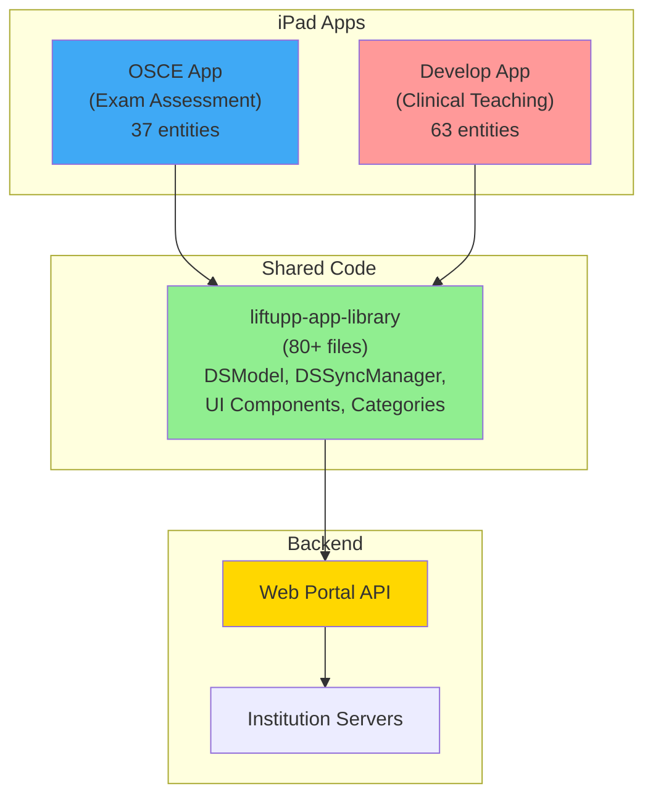

# LIFTUPP iPad Apps - Complete Documentation Suite

This repository contains comprehensive documentation for the LIFTUPP (Liverpool iPad For Teaching University Professional Practice) platform, which consists of two related iPad applications for clinical assessment and teaching in dental and medical education.

## Repository Overview

### Two Complementary Apps

- **[osce-ios](https://github.com/DanSmithTII/osce-ios)** (also known as **"OSCE"**)
  - **Purpose**: Structured OSCE examination delivery
  - **Focus**: Station-based circuit assessments with real-time feedback
  - **Display Name**: "OSCE"
  - **Entities**: 37 Core Data entities
  - **Key Features**: Timer management, station rotations, assistance requests, marking matrices

- **[liftupp-for-ipad](https://github.com/DanSmithTII/liftupp-for-ipad)** (also known as **"Develop"**)
  - **Purpose**: Clinical teaching and case-based learning
  - **Focus**: Patient-centered clinical assessment with diagnosis and treatment tracking
  - **Display Name**: "Develop"
  - **Entities**: 63 Core Data entities
  - **Key Features**: Patient logging, diagnosis entry, procedures, interventions, investigations, adaptive thresholds

### Shared Foundation
- Both apps share the **liftupp-app-library** common codebase (80+ files)
- Common assessment framework (forms, sections, questions, students, staff)
- Shared sync architecture and network infrastructure
- Common UI components and utility functions

## Documentation Structure

### For Product Owners & Stakeholders
- **[Product Owner Guide](product-owner-guide.md)** - Features, user journeys, and value proposition

### For Technical Teams
- **[Architecture Overview](architecture-overview.md)** - High-level system architecture with diagrams
- **[Component Architecture](component-architecture.md)** - System components, dependencies, and design patterns
- **[Data Model Reference](data-model.md)** - Complete Core Data model documentation
- **[Sync Architecture](sync-architecture.md)** - Synchronization and web portal integration
- **[Technical Debt Analysis](technical-debt-analysis.md)** - Code quality assessment and refactoring recommendations
- **[Shared Library Documentation](shared-library.md)** - liftupp-app-library detailed reference
- **[Technical Guide](technical-guide.md)** - Development setup and guidelines

## Quick Start

### For Product Owners
Start with the [Product Owner Guide](product-owner-guide.md) to understand:
- What the apps do and why they exist (OSCE vs Develop)
- Key features and workflows for each app
- User personas and journeys
- Business value and benefits

### For Developers
Begin with the [Architecture Overview](architecture-overview.md), then:
1. Review the [Data Model Reference](data-model.md) to understand data structures (37 vs 63 entities)
2. Study the [Sync Architecture](sync-architecture.md) for backend integration
3. Explore the [Shared Library Documentation](shared-library.md) for reusable components
4. Consult the [Technical Guide](technical-guide.md) for development practices

## Technology Stack

**Common to Both Apps:**
- **Languages**: Objective-C (primary), Swift (security/modern features)
- **Platform**: iOS 12.0+, iPad only, landscape orientation
- **Persistence**: Core Data (SQLite-backed)
- **Networking**: AFNetworking 4.0
- **Logging**: CocoaLumberjack 3.8 (OSCE) / Native logging (Develop)
- **Analytics**: Firebase Crashlytics
- **Security**: iOS Keychain for sensitive data
- **Dependency Management**: CocoaPods

**App-Specific:**
- **OSCE**: 37 Core Data entities, focus on exam circuits
- **Develop**: 63 Core Data entities, includes patient management and clinical workflows

## System Architecture

## Key Features

### OSCE App - Examination Assessment

- **Station-based OSCE circuits** - Multiple assessment stations with timed rotations
- **Marking matrices** - Structured evaluation with predefined descriptors
- **Timer management** - Countdown timers with visual/audio alerts
- **Assistance requests** - Real-time help system across stations
- **Real-time comments** - Circuit, station, and candidate-level feedback
- **Station rotations** - Automated student movement through examination stations

### Develop App - Clinical Teaching

- **Patient logging** - Comprehensive patient record management with demographics
- **Diagnosis tracking** - Medical diagnoses with grouping and categorization
- **Procedures & interventions** - Track clinical procedures and therapeutic interventions
- **Investigations** - Medical tests and investigation tracking
- **Adaptive thresholds** - Difficulty-based assessment with threshold management
- **Clinical alerts** - Alert system for clinic management and signout
- **Enhanced question types** - Binary, Boolean, FreeText, Feedback, Record, Procedure questions

### Shared Features (Both Apps)

- **Form-based evaluation** - Customizable assessment forms with sections and questions
- **Real-time attendance** - Track student attendance and presence
- **Student management** - Student groups, majors, and performance tracking
- **Offline-first design** - Full functionality without internet
- **Bidirectional sync** - Automatic synchronization with web portal
- **Multi-institution support** - 13+ UK institutions configured
- **Secure storage** - Keychain-based credential management
- **Master-detail interface** - iPad-optimized workflows
- **Institution branding** - Customizable colors and logos

## App Comparison

| Aspect | OSCE | Develop |
|--------|------|---------|
| **Primary Purpose** | OSCE examination delivery | Clinical teaching & case-based learning |
| **Core Data Entities** | 37 | 63 |
| **Assessment Model** | Station-based circuits | Patient-centered clinical cases |
| **Timer Management** | Yes (essential feature) | Optional (clinic management) |
| **Patient Records** | No | Yes (full patient management) |
| **Clinical Content** | Comments & feedback | Diagnoses, procedures, interventions, investigations |
| **Question Types** | Standard form questions | 6 specialized question types |
| **Thresholds** | Marking descriptors | Adaptive difficulty thresholds |
| **Alert System** | Assistance requests | Clinical alerts & signout failures |
| **Current Version** | 1.0.24 | 1.5.19 |

## Project Status

- **OSCE App Version**: 1.0.24
- **Develop App Version**: 1.5.19
- **Active Institutions**: Liverpool, Manchester, QMUL, King's, Belfast, Scotland (Aberdeen, Dundee, Glasgow), Cardiff, Portsmouth, Leicester, and more
- **Platform**: Production use across UK dental and medical schools
- **Maintenance**: Active development and support
- **Deployment Model**: On-premises institutional servers with iPad clients

## Documentation Notes

Throughout the documentation, features and entities are clearly marked as:
- **[OSCE]** - Specific to the OSCE examination app
- **[Develop]** - Specific to the Develop teaching app
- **[Both]** - Common to both applications

When no marker is present, the feature is shared across both apps.

## Contributing

This documentation is maintained to support ongoing development and institutional deployment. For updates or corrections, please submit pull requests.

## License

© The University of Liverpool. All rights reserved.
